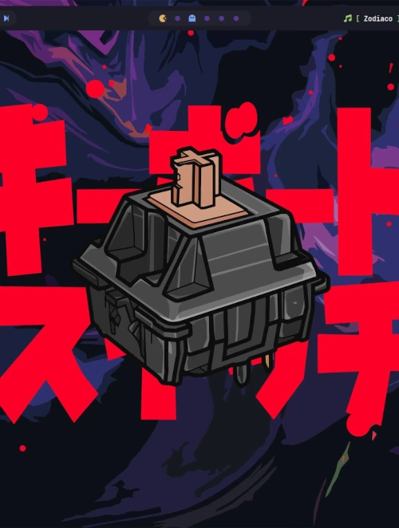
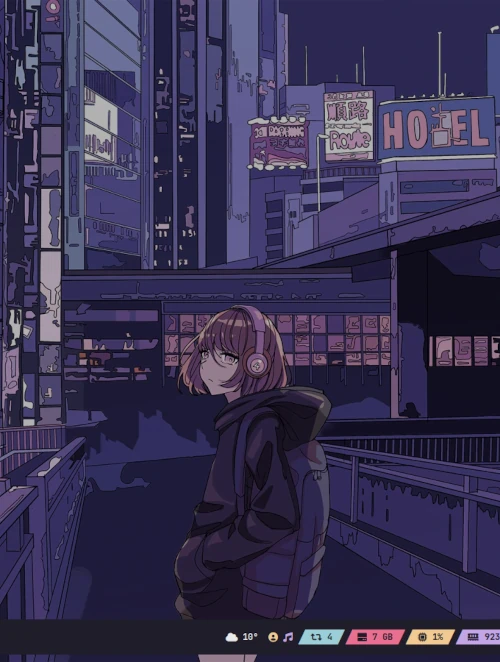
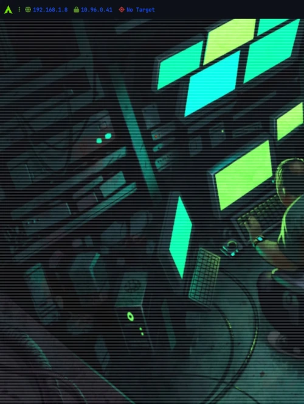

# 🐧 bspwm Rice Universal

Escritorio **bspwm** completo y listo para usar en **Arch, Fedora, Debian y Ubuntu**,
con **3 temas** que se cambian en caliente. Está basado en los
[dotfiles de gh0stzk](https://github.com/gh0stzk/dotfiles) y adaptado para funcionar
en varias distros: **un solo instalador** detecta tu sistema e instala todo.

<p align="center">
  
  
  
</p>

- ✅ **Convive con tu escritorio actual** (GNOME, KDE…): solo añade la sesión
  **bspwm** a la pantalla de login y no toca tu entorno principal.
- ✅ **Backup automático** de tus configuraciones anteriores.
- ✅ **Probado automáticamente** en contenedores limpios de cada distro (ver [Pruebas](#-pruebas-automáticas)).

---

## 📑 Índice

- [Distros soportadas](#-distros-soportadas)
- [Requisitos](#-requisitos)
- [Instalación](#-instalación)
- [Primer inicio](#-primer-inicio)
- [Temas](#-temas)
- [Atajos de teclado](#️-atajos-de-teclado)
- [Componentes](#-componentes)
- [Personalización](#-personalización)
- [Actualizar y desinstalar](#-actualizar-y-desinstalar)
- [Solución de problemas](#-solución-de-problemas)
- [Pruebas automáticas](#-pruebas-automáticas)
- [Estructura del repositorio](#-estructura-del-repositorio)
- [Contribuir](#-contribuir)
- [Créditos y licencia](#-créditos-y-licencia)
- 📄 **[COMPONENTS.md](COMPONENTS.md)**: paquetes y equivalencias por distro

---

## 🐧 Distros soportadas

| Distro | Versión probada | Estado | Notas |
|---|---|---|---|
| **Arch Linux** (y derivadas) | rolling | ✅ Soportada | distro de origen del rice |
| **Fedora** | 43 | ✅ Soportada | distro de uso diario del autor |
| **Debian** | 13 (trixie) | ✅ Soportada | |
| **Debian** | 12 (bookworm) | ✅ Soportada | picom 9: sin animaciones |
| **Ubuntu** (y derivadas: Mint, Pop!_OS…) | 24.04 LTS | ✅ Soportada | picom 10: sin animaciones |
| openSUSE | — | 🧪 Experimental | sin probar; puede requerir ajustes |

Las derivadas (EndeavourOS, Manjaro, Nobara, Mint, Pop!_OS…) se detectan por
`ID_LIKE` y usan la lista de paquetes de su distro base.

---

## ✅ Requisitos

- Una distro soportada, en **x86_64**.
- Un usuario normal con **sudo** (el instalador se niega a ejecutarse como root).
- **Conexión a internet** (descarga fuentes, temas y algunos binarios).
- Un gestor de login capaz de iniciar sesiones **X11** (GDM, SDDM, LightDM…).
  bspwm **no funciona en Wayland**.
- Unos **2-3 GB** libres (paquetes + fuentes + temas). Si además compilas eww,
  cuenta con **~2 GB más** (Rust) y entre 5 y 15 minutos extra.

---

## 🚀 Instalación

> ⚠️ **Lee `install.sh` antes de ejecutarlo.** Es un script corto y comentado.
> Tus configuraciones actuales se mueven a `~/.RiceBackup/<fecha>/` antes de copiar las nuevas.

```bash
git clone https://github.com/p4uty/bspwm-rice-universal.git
cd bspwm-rice-universal
./install.sh
```

El script solo hace **una pregunta al principio**: si quieres compilar **eww** e
**i3lock-color** (ver [Componentes](#-componentes)). Después termina solo.

### Opciones

| Opción | Qué hace |
|---|---|
| `-y`, `--yes` | No pregunta nada (por defecto **no** compila eww/i3lock-color) |
| `--build` | Compila eww e i3lock-color sin preguntar |
| `--no-build` | No compila eww ni i3lock-color |
| `--no-chsh` | No cambia tu shell de login a zsh |
| `--print-packages` | Muestra los paquetes que instalaría en tu distro y sale (no instala nada) |
| `-h`, `--help` | Ayuda |

Ejemplo de instalación completa y desatendida:

```bash
./install.sh --yes --build
```

### Qué hace el instalador

1. Detecta tu distro (`/etc/os-release`) y comprueba la arquitectura y sudo.
2. Mueve tus configuraciones previas a `~/.RiceBackup/<fecha>/`.
3. Instala los paquetes del sistema con el gestor de tu distro (`pacman`, `dnf`, `apt`).
   En **Arch** usa `pacman -Syu`, así que también **actualiza el sistema**.
4. Instala las fuentes incluidas y descarga **JetBrainsMono Nerd Font**.
5. Descarga los temas GTK, los iconos y el cursor de gh0stzk.
6. Instala binarios oficiales en `~/.local/bin`: **yazi**, **lazydocker** y, si tu
   distro no los trae (o son demasiado antiguos), **eza**, **bottom**, **fzf** y **Neovim ≥ 0.12**.
7. (Opcional) Compila **eww** e **i3lock-color**.
8. Copia los dotfiles a `~/.config` y `~/`.
9. Clona los plugins de zsh y pone **zsh** como shell de login.
10. Comprueba que estén todos los comandos necesarios y muestra un **resumen de avisos**.

Todo lo que ocurre queda registrado en `~/.cache/bspwm-rice-install-<fecha>.log`.

---

## 🖥️ Primer inicio

1. **Cierra sesión.**
2. En la pantalla de login elige la sesión **bspwm**. Suele estar en un icono de
   engranaje o en un desplegable, según tu gestor de login.
3. La primera vez aparece un **mensaje de bienvenida** con los atajos básicos.

Al arrancar, `SetSysVars` detecta automáticamente tu interfaz de red, la batería y
el control de brillo para la barra. En un PC de escritorio, los módulos de batería
y brillo simplemente no muestran datos.

---

## 🎨 Temas

Se cambian en caliente con **`Alt + Space`**:

| Tema | Estilo | Barra |
|---|---|---|
| **emilia** | Tokyo Night (azul/morado) | CPU, RAM, disco e IP a la izquierda; red, volumen y actualizaciones a la derecha |
| **cristina** | Rosé Pine Moon | escritorios y título a la izquierda; todo lo demás a la derecha |
| **h4ck3r** | verde "hacker" | red, **VPN** e IP de objetivo (`target`) |

Cada tema cambia a la vez: colores de la terminal, bordes, polybar, rofi, dunst,
GTK, iconos y Neovim. El wallpaper de cada tema se elige con `super + alt + w` y
**se recuerda por tema** aunque reinicies.

---

## ⌨️ Atajos de teclado

`super` = tecla Windows. Pulsa **`super + c`** para ver la hoja completa (requiere eww)
o consulta [`.config/bspwm/config/sxhkdrc`](.config/bspwm/config/sxhkdrc).

| Atajo | Acción |
|---|---|
| `super + Return` | Terminal (`super + alt + Return`: terminal flotante) |
| `super + Space` | Menú de aplicaciones (rofi) |
| `Alt + Space` | Selector de temas |
| `super + c` | Hoja de atajos |
| `super + b` / `e` / `f` | Navegador / editor (geany) / gestor de archivos (Thunar) |
| `super + y` / `v` | yazi / Neovim |
| `super + k` | KeePassXC |
| `super + p` | Mezclador de audio |
| `super + r` | Editor visual de temas (RiceEditor) |
| `super + x` / `super + shift + x` | Cerrar / matar ventana |
| `super + 1…0` | Ir al escritorio 1-10 (`+ ctrl`: mover la ventana allí) |
| `super + ←/→` | Escritorio anterior / siguiente |
| `super + alt + ←↓↑→` | Mover el foco entre ventanas |
| `ctrl + alt + ←↓↑→` | Intercambiar ventanas |
| `alt + t` / `alt + f` / `alt + a` | Ventana en mosaico / pantalla completa / flotante |
| `alt + Tab` | Selector de ventanas |
| `super + alt + w` | Selector de wallpaper |
| `super + alt + t` | Elegir terminal (kitty / alacritty) |
| `super + alt + o` | Terminal desplegable (scratchpad) |
| `super + alt + s` / `Print` | Capturas (`Print`: pantalla completa, `shift + Print`: área) |
| `super + alt + n` / `b` | Menú de red / bluetooth |
| `super + alt + p` | Menú de apagado |
| `super + alt + h` / `u` | Ocultar / mostrar la barra |
| `super + alt + r` | Reiniciar bspwm |
| `super + Escape` | Recargar los atajos |
| `ctrl + super + alt + l` | Bloquear pantalla (requiere i3lock-color) |
| Teclas multimedia | Volumen, brillo, reproducción, calculadora, silenciar micrófono |

---

## 🧩 Componentes

| Rol | Herramienta |
|---|---|
| Gestor de ventanas | **bspwm** |
| Atajos de teclado | **sxhkd** |
| Barra | **polybar** |
| Compositor | **picom** (con animaciones en picom ≥ 12) |
| Lanzador y menús | **rofi** |
| Notificaciones | **dunst** |
| Terminal | **kitty** (por defecto) · alacritty |
| Shell | **zsh** (autosuggestions, syntax-highlighting, fzf-tab, history-substring-search) |
| Gestor de archivos | **yazi** (terminal) · **Thunar** (gráfico) |
| Editor | **Neovim ≥ 0.12** (config con `vim.pack`) · geany |
| Navegador | el primero disponible: Brave, Firefox, Chromium… (**no se instala**) |
| Contraseñas | **KeePassXC** |
| Bloqueo de pantalla | **i3lock-color** (opcional, se compila) |
| Widgets | **eww** (opcional, se compila): hoja de atajos y tarjeta de perfil |
| Wallpaper | **feh** + guardado automático por tema |
| Monitor del sistema | **btm** (bottom) |
| Docker | **lazydocker** |

**¿Compilar eww e i3lock-color?** Los 3 temas usan polybar, así que el escritorio
funciona sin ellos. Solo perderías la hoja de atajos (`super + c`), la tarjeta de
perfil y el bloqueo de pantalla. Se pueden compilar más tarde con `./install.sh --build`.

La lista completa de paquetes, con su nombre en cada distro, está en **[COMPONENTS.md](COMPONENTS.md)**.

---

## 🛠️ Personalización

| Quiero cambiar… | Archivo |
|---|---|
| Atajos de teclado | `~/.config/bspwm/config/sxhkdrc` (recarga: `super + Escape`) |
| Apps de los atajos (navegador, etc.) | `~/.config/bspwm/bin/OpenApps` |
| Colores, bordes y opacidad de un tema | `~/.config/bspwm/rices/<tema>/theme-config.bash`, o `super + r` (editor visual) |
| Módulos de la barra | `~/.config/bspwm/rices/<tema>/config.ini` y `modules.ini` |
| Red, batería y brillo de la barra | `~/.config/bspwm/config/system.ini` |
| Animaciones y sombras | `~/.config/bspwm/config/picom/` |
| Reglas de ventanas y autostart | `~/.config/bspwm/bspwmrc` |
| Shell | `~/.zshrc` |

### Cambios respecto al rice original de gh0stzk

- **Multi-distro**: la lógica que depende de la distro vive solo en `install.sh` y
  en scripts que **detectan el gestor de paquetes al ejecutarse** (`SysUpdate`, `Updates`, `.zshrc`).
  Las rutas que cambian entre distros (plugins de zsh, agente polkit, navegador,
  calculadora) se buscan en tiempo de ejecución.
- **Bordes**: solo la ventana enfocada tiene borde (2 px, color del tema); con una
  sola ventana no hay borde.
- **Wallpaper persistente por tema** con el script `WallWatch` (inotify). El selector
  de temas muestra el wallpaper actual de cada uno.
- **Módulo de IP** en la barra, actualizado cada 2 s.
- **Barras simplificadas**: sin módulos de música (mpd).
- **Logo de Tux** en el lanzador.
- **Atajos extra**: `super + c` (hoja de atajos), `super + k` (KeePassXC) y teclas
  especiales (calculadora, captura, bloqueo, silenciar micrófono).
- **Eliminado** lo que dependía de paquetes de AUR o de servicios extra: temas
  `andrea` y `z0mbi3`, mpd/ncmpcpp/cava, ghostty, wallpapers animados, RofiPass,
  Android Mount y el gestor de portapapeles.
- **Terminal**: `Ctrl+C` / `Ctrl+V` para copiar y pegar en kitty; `ls` detallado con
  eza y colores distintos en cada tema.

---

## 🔄 Actualizar y desinstalar

**Actualizar** a la última versión del repo:

```bash
cd bspwm-rice-universal
git pull
./install.sh
```

El instalador vuelve a hacer backup de tu configuración actual, así que si has
personalizado algo, lo tendrás en `~/.RiceBackup/<fecha>/` para recuperarlo.

**Desinstalar** (volver a tu configuración anterior):

1. En la pantalla de login, elige de nuevo tu escritorio habitual.
2. Borra la configuración del rice y restaura tu backup:

   ```bash
   rm -rf ~/.config/{bspwm,kitty,alacritty,dunst,nvim,yazi,zathura,mpv,geany,gtk-3.0}
   cp -a ~/.RiceBackup/<fecha>/. ~/.config/        # carpetas de ~/.config
   mv ~/.config/.zshrc ~/.config/.gtkrc-2.0 ~/ 2>/dev/null   # archivos de ~/
   ```

3. (Opcional) Vuelve a bash: `chsh -s /bin/bash`.
4. (Opcional) Desinstala los paquetes que no quieras con el gestor de tu distro
   (lista en [COMPONENTS.md](COMPONENTS.md)) y borra los binarios de `~/.local/bin`
   (yazi, ya, lazydocker, eza, btm, fzf, eww), `/opt/nvim` y `/usr/local/bin/{nvim,i3lock}`.

---

## 🩺 Solución de problemas

<details>
<summary><b>No aparece la sesión "bspwm" en la pantalla de login</b></summary>

- Comprueba que exista `/usr/share/xsessions/bspwm.desktop` (lo instala el paquete `bspwm`).
- Tu gestor de login tiene que admitir sesiones **X11**. Algunas versiones recientes
  de GDM solo muestran sesiones Wayland; en ese caso instala otro gestor de login
  (por ejemplo LightDM o SDDM).
- Comprueba que el servidor Xorg esté instalado (`Xorg -version`).
</details>

<details>
<summary><b>Pantalla negra o sin barra al entrar</b></summary>

- Abre una terminal con `super + Return` y ejecuta `~/.config/bspwm/bin/Theme.sh`
  para ver los errores.
- Revisa el final del registro de instalación (`~/.cache/bspwm-rice-install-*.log`):
  ahí se listan los paquetes que no se pudieron instalar.
</details>

<details>
<summary><b>Los iconos de la barra se ven como cuadrados</b></summary>

Faltan fuentes. Ejecuta `fc-list | grep -i "JetBrainsMono Nerd"`; si no sale nada,
vuelve a ejecutar `./install.sh` con internet o instala la fuente a mano desde
[nerd-fonts](https://github.com/ryanoasis/nerd-fonts/releases), y después `fc-cache -f`.
</details>

<details>
<summary><b>No hay animaciones al abrir y cerrar ventanas</b></summary>

Las animaciones necesitan **picom ≥ 12** (`picom --version`). Debian 12 (picom 9) y
Ubuntu 24.04 (picom 10) traen versiones anteriores: todo funciona igual, pero sin animaciones.
</details>

<details>
<summary><b>La barra no muestra la red, la batería o el brillo correctos</b></summary>

Edita `~/.config/bspwm/config/system.ini`. Para forzar que se vuelvan a detectar,
borra `~/.config/bspwm/config/.sys` y reinicia bspwm (`super + alt + r`).
</details>

<details>
<summary><b>super + c o el bloqueo de pantalla no hacen nada</b></summary>

Necesitan **eww** e **i3lock-color**. Compílalos con `./install.sh --build`. Si la
compilación falla, el log queda en `~/.cache/bspwm-rice-eww-build.log` o
`~/.cache/bspwm-rice-i3lock-build.log`.
</details>

<details>
<summary><b>Neovim pide instalar plugins al abrirlo</b></summary>

Es normal la primera vez: la configuración usa el gestor `vim.pack` de Neovim 0.12,
que pide confirmación antes de descargar los plugins. Acepta y espera a que termine.
</details>

<details>
<summary><b>super + b no abre ningún navegador</b></summary>

El rice no instala navegador. Instala Brave, Firefox o Chromium, o edita la lista en
`~/.config/bspwm/bin/OpenApps`.
</details>

<details>
<summary><b>Un paquete no existe en mi distro</b></summary>

El instalador avisa con `[!]` y sigue. Busca el nombre equivalente en
[COMPONENTS.md](COMPONENTS.md) e instálalo a mano. Si es un nombre que cambió en
una versión nueva de tu distro, abre un *issue* o un *pull request*.
</details>

---

## 🧪 Pruebas automáticas

`tests/run-tests.sh` prueba la instalación en **contenedores limpios** de cada distro
(con podman o docker) y arranca una **sesión bspwm real** en un servidor X virtual (Xvfb):

```bash
tests/run-tests.sh                   # Arch, Fedora 43, Debian 12, Debian 13, Ubuntu 24.04
tests/run-tests.sh fedora debian12   # solo algunas
RICE_BUILD=y tests/run-tests.sh      # también compila eww e i3lock-color (lento)
```

En cada distro comprueba:

1. `install.sh --yes` termina y quedan instalados todos los comandos necesarios.
2. La sintaxis de todos los scripts del rice.
3. Que `zsh` arranque sin errores y que Neovim abra la configuración.
4. Que en la sesión bspwm arranquen **bspwm, sxhkd, polybar, picom, dunst y xsettingsd**,
   que **cada tema** levante su barra, y hace una **captura de pantalla** de cada uno.

Los resultados (logs y capturas) se guardan en `tests/results/<distro>/`.

---

## 📂 Estructura del repositorio

```
bspwm-rice-universal/
├── install.sh              # instalador universal
├── COMPONENTS.md           # paquetes por distro
├── .config/
│   ├── bspwm/
│   │   ├── bspwmrc         # arranque de la sesión
│   │   ├── bin/            # scripts (temas, wallpapers, menús, capturas…)
│   │   ├── config/         # sxhkdrc, picom, temas de rofi, módulos por app
│   │   ├── eww/            # widgets (hoja de atajos, tarjeta de perfil)
│   │   └── rices/          # los 3 temas: colores, barra y wallpapers
│   ├── kitty/ alacritty/ dunst/ nvim/ yazi/ mpv/ zathura/ geany/ gtk-3.0/
├── home/                   # archivos que van en ~ (.zshrc, .gtkrc-2.0, cursor)
├── assets/fonts/           # fuentes de iconos incluidas
└── tests/                  # pruebas en contenedores
```

---

## 🤝 Contribuir

Se agradecen *issues* y *pull requests*, sobre todo para:

- Nombres de paquetes que cambien en versiones nuevas de las distros.
- Soporte probado para otras distros (openSUSE, Void…); ver [COMPONENTS.md §6](COMPONENTS.md#6-añadir-soporte-a-una-distro-nueva).

Antes de enviar cambios en `install.sh`, ejecuta `tests/run-tests.sh` (o al menos la
distro que hayas tocado). Si reportas un fallo, adjunta el log de
`~/.cache/bspwm-rice-install-*.log`.

---

## 🙏 Créditos y licencia

- Basado en **[gh0stzk/dotfiles](https://github.com/gh0stzk/dotfiles)**: scripts,
  temas, configuración de polybar, rofi y eww.
- Temas GTK, iconos, cursor y fuentes de iconos: paquetes de gh0stzk.
- Adaptación multi-distro y personalizaciones: [p4uty](https://github.com/p4uty).

Licencia: **[GPL-3.0](LICENSE)**, la misma que el proyecto original. Las fuentes de
`assets/fonts/` mantienen sus propias licencias (ver [assets/fonts/README.md](assets/fonts/README.md)).
